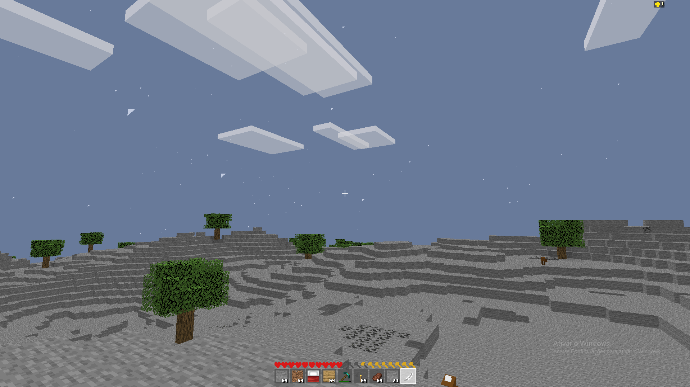
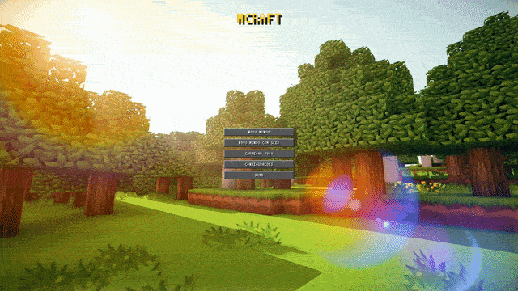
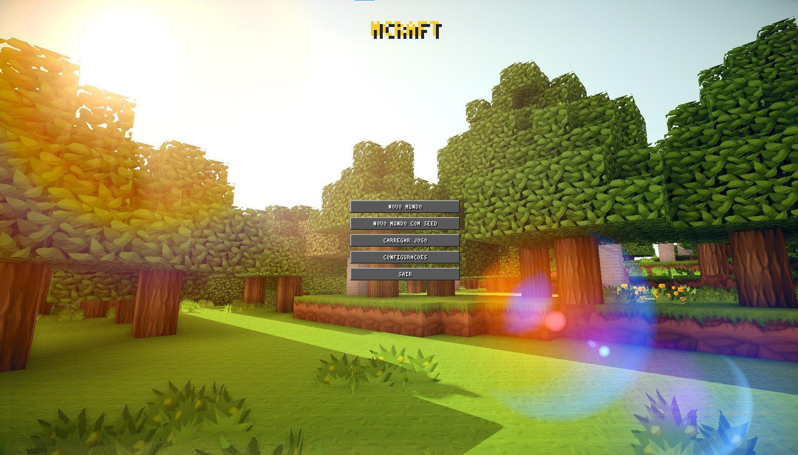
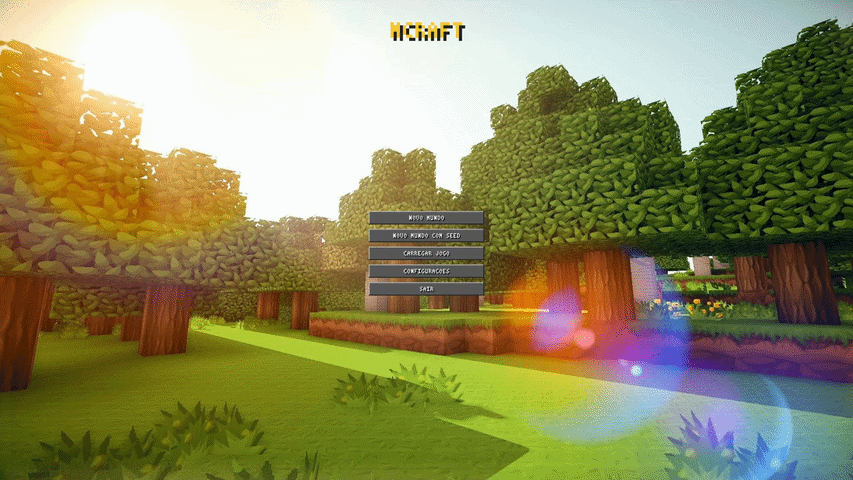
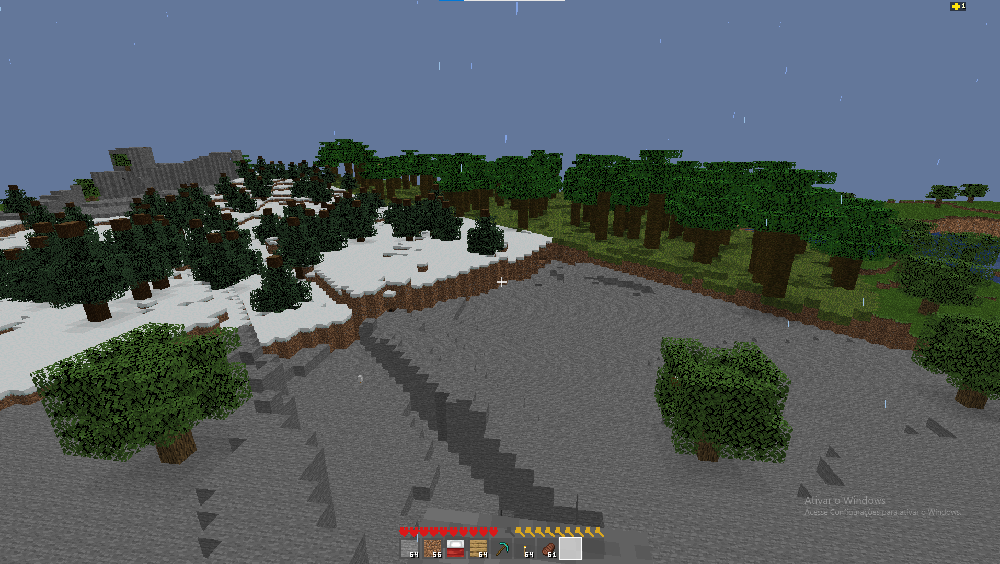
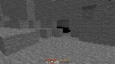
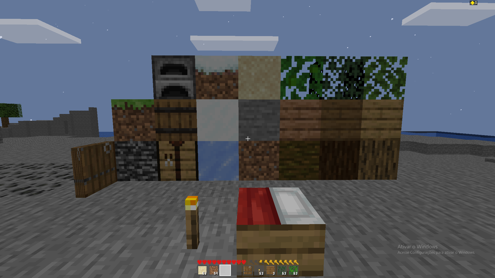
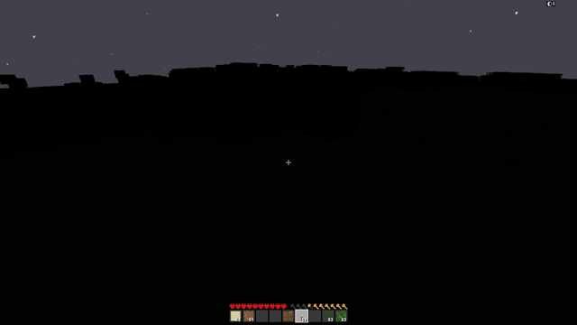
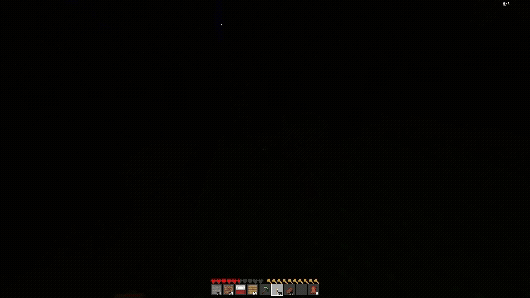
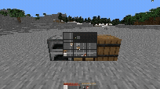

# MCraft — Clone de Minecraft Classico em Java

> Um clone funcional do Minecraft (estilo Alpha/Beta classico) construido do zero em **Java puro**, usando **LWJGL 3** (OpenGL 3.3 Core Profile) para renderizacao, sem nenhuma engine externa. Geracao procedural de mundo, iluminacao dinamica por propagacao de luz, sistema de sobrevivencia completo, mobs com IA simples e persistencia em disco.

<p align="center">
  
</p>

---

## Indice

1. [Visao Geral](#visao-geral)
2. [Stack Tecnico](#stack-tecnico)
3. [Arquitetura de Pacotes](#arquitetura-de-pacotes)
4. [Como Executar](#como-executar)
5. [Menu Principal](#menu-principal)
6. [Controles](#controles)
7. [Geracao Procedural de Mundo](#geracao-procedural-de-mundo)
8. [Sistema de Chunks e Renderizacao](#sistema-de-chunks-e-renderizacao)
9. [Sistema de Texturas — De Pixel Procedural a Atlas de Imagens](#sistema-de-texturas--de-pixel-procedural-a-atlas-de-imagens)
10. [Sistema de Iluminacao](#sistema-de-iluminacao)
11. [Mobs e IA](#mobs-e-ia)
12. [Sobrevivencia do Jogador](#sobrevivencia-do-jogador)
13. [Ciclo Dia/Noite e Clima](#ciclo-dianoite-e-clima)
14. [Inventario, UI e Crafting](#inventario-ui-e-crafting)
15. [Persistencia (Save/Load)](#persistencia-saveload)
16. [Otimizacoes de Performance](#otimizacoes-de-performance)
17. [Estrutura de Pastas](#estrutura-de-pastas)
18. [Limitacoes Conhecidas e Funcionalidades Nao Implementadas](#limitacoes-conhecidas-e-funcionalidades-nao-implementadas)
19. [Roadmap](#roadmap)
20. [Licenca](#licenca)

---

## Visao Geral

Este projeto e uma recriacao do Minecraft classico construida inteiramente do zero, sem motor de jogo (Unity, Godot, etc.) e sem bibliotecas de alto nivel de voxel engine. Toda a pipeline grafica — desde a triangulacao da mesh de cada chunk at o calculo de iluminacao por propagacao de luz — foi implementada manualmente em Java sobre OpenGL 3.3 Core Profile via LWJGL 3.

O objetivo do projeto e didatico e de portfolio: explorar na pratica os fundamentos de geracao procedural de terreno, otimizacao de renderizacao de voxels, gerenciamento de memoria em jogos de mundo aberto, e arquitetura de sistemas de jogo (inventario, crafting, IA simples, persistencia) sem depender de frameworks que escondam essas decisoes.

**Destaques tecnicos:**
- Geracao de terreno multi-bioma com transicoes suaves e cavernas 3D
- Engine de iluminacao por propagacao BFS (sky light + block light) inspirada no algoritmo classico do Minecraft, calculada de forma assincrona
- Pipeline de renderizacao com culling de faces, culling de frustum, batching e gerenciamento de buffers GPU otimizado
- Sistema de sobrevivencia completo (vida, fome, respiracao/natacao, armadura, durabilidade)
- Persistencia binaria customizada (sem serializacao generica) para mundo, chunks, inventarios, baus, fornalhas e mobs

---

## Stack Tecnico

| Componente | Tecnologia |
|---|---|
| Linguagem | Java 17 |
| Build | Maven |
| Janela / Input | GLFW (via LWJGL 3) |
| Graficos | OpenGL 3.3 Core Profile (shaders GLSL customizados) |
| Audio | OpenAL (via LWJGL 3) |
| Decodificacao de imagem | STB Image (via LWJGL 3) |
| Matematica de Vetores/Matrizes | Implementacao propria (sem JOML/GLM) |

Nenhuma engine de jogo, framework de ECS ou biblioteca de voxel foi utilizada — todo o pipeline (camera, shaders, buffers, raycasting, fisica AABB, geracao de mesh) e codigo proprio.

---

## Arquitetura de Pacotes

```
com.mcraft/
├── audio/      SoundEvent, SoundManager
├── core/       Window, GameLoop, Input, GameSettings
├── world/      Block, Chunk, World, WorldGen, Biome, DayNightCycle,
│               WeatherSystem, LightEngine, FurnaceState
├── render/     Camera, ChunkRenderer, ChunkMeshBufferPool, TextureAtlas, Texture2D, Shader,
│               BreakOverlay, LightScheduler, Frustum2D, Frustum, SkyRenderer
├── player/     Player, Raycast
├── entity/     Mob, MobManager, MobRenderer, Entity, MobCategory
└── ui/         Screen2D (base), MenuScreen, InventoryScreen, ChestScreen,
                CraftingScreen, FurnaceScreen, HUD, PixelFont,
                Inventory, CraftingGrid, PauseScreen
```

A separacao segue responsabilidades claras: `world` concentra dados e regras do mundo (sem nenhuma chamada OpenGL), `render` concentra tudo relacionado a GPU, e `ui` isola toda a logica de interface 2D atras de uma classe base (`Screen2D`) que elimina duplicacao entre as diferentes telas (menu principal, inventario, bau, fornalha, bancada).

---

## Como Executar

```bash
# Pre-requisitos: JDK 17+, Maven 3.8+

git clone <url-do-repositorio>
cd mcraft
mvn clean package
java -jar target/mcraft-<versao>.jar
```

Ao iniciar, o jogo abre direto no **Menu Principal** (ver secao a seguir) — nenhum mundo e gerado ou carregado automaticamente. O jogador escolhe explicitamente entre criar um mundo novo (com seed aleatoria ou customizada), carregar um save existente, ajustar configuracoes ou sair. Os saves ficam em `saves/{worldName}/` e as preferencias de configuracao em `settings.properties`, na raiz do projeto.

<p align="center">
  
</p>

---

## Menu Principal

Antes de qualquer mundo ser gerado ou carregado, o jogo exibe um menu principal completo, renderizado pela mesma infraestrutura 2D (`Screen2D`) usada pelas telas de inventario, bau e fornalha — reaproveitando primitivas de retangulo, deteccao de clique e a fonte bitmap propria (`PixelFont`), sem nenhuma dependencia de UI externa.

<p align="center">
  
</p>

### Estrutura

O menu opera com 4 sub-estados internos:

| Sub-estado | Funcao |
|---|---|
| **Principal** | Botoes de entrada: Novo Mundo, Novo Mundo com Seed, Carregar Jogo, Configuracoes, Sair |
| **Entrada de Seed** | Campo numerico para digitar uma seed customizada (digitos 0-9, com backspace e confirmacao via Enter ou clique) |
| **Carregar Jogo** | Lista dinamica de pastas encontradas em `saves/`, geradas em tempo real ao abrir a tela — cada save existente vira um botao clicavel |
| **Configuracoes** | Distancia de renderizacao, volume mestre, sensibilidade do mouse e alternancia de tela cheia, com botoes de incremento/decremento |

O menu roda em **seu proprio loop**, totalmente independente do `GameLoop` da partida: nenhum mundo, chunk, player ou mob e instanciado enquanto o jogador esta navegando pelo menu. Somente quando uma opcao de jogo e efetivamente escolhida (`PlayRequest`, contendo nome do mundo, seed e se e um mundo novo) o `GameLoop` e construido e seu `run()` e chamado — mantendo a inicializacao do menu instantanea, independente do custo de geracao de mundo.

<p align="center">
  
</p>

### Texto no Menu — Extensao do `PixelFont`

A fonte bitmap original (`PixelFont`) so suportava digitos numericos, suficiente para HUD (vida, fome, contador de dias) mas insuficiente para rotulos de menu legiveis. Para evitar introduzir uma dependencia de fonte externa apenas para o menu, o `PixelFont` foi estendido com bitmaps de **letras maiusculas (A-Z)** no mesmo estilo matricial 3x5 dos digitos originais, mantendo o projeto 100% livre de assets de fonte.

### Configuracoes Persistentes

As preferencias do jogador (`GameSettings`) sao salvas em um arquivo de texto simples (`settings.properties`, formato `java.util.Properties`), separado do formato binario customizado usado para os saves de mundo — uma escolha deliberada, já que configuracoes de jogo nao tem a mesma necessidade de versionamento binario compacto que os dados de mundo.

| Configuracao | Efeito |
|---|---|
| Distancia de Renderizacao | Substitui a antiga constante fixa `RENDER_DISTANCE`; agora e um parametro de instancia do `World`, ajustavel em tempo real pelo menu |
| Volume Mestre | Multiplicador aplicado a todas as chamadas de audio do `SoundManager` |
| Sensibilidade do Mouse | Multiplicador aplicado a rotacao da camera, junto da sensibilidade base |
| Tela Cheia | Persistida para ser aplicada na proxima inicializacao da janela (alternar monitor em tempo de execucao via `glfwSetWindowMonitor` fica fora do escopo atual) |

---

## Controles

| Tecla / Acao | Funcao |
|---|---|
| `W A S D` | Movimento |
| `Mouse` | Olhar |
| `Espaco` | Saltar / Nadar para cima |
| `Shift` | Mergulhar (dentro da agua) |
| `Ctrl` | Correr (consome fome) |
| `Clique Esquerdo` | Quebrar bloco (segurar) / Atacar mob |
| `Clique Direito` | Colocar bloco / Interagir (bau, fornalha, bancada, cama, porta) / Comer |
| `1-9` | Selecionar slot da hotbar |
| `E` | Abrir/fechar inventario |
| `Esc` | Fechar tela atual / Sair |

---

## Geracao Procedural de Mundo

### Ruido e Biomas

<p align="center">
  
</p>

O terreno e gerado com **Perlin noise 2D e 3D multi-oitava (fBm)** implementado manualmente (sem bibliotecas de ruido). Dois sinais independentes determinam o bioma de cada coluna `(x, z)`:

1. **Ruido continental** (escala grande, ~1200 unidades): decide se o ponto e oceano (`OCEAN`) ou terra firme, gerando massas continentais coerentes em vez de oceanos espalhados aleatoriamente.
2. **Temperatura x Umidade** (duas amostras de fBm independentes): em pontos classificados como terra firme, esses dois valores selecionam entre 7 biomas terrestres.

Para evitar que o ruido de Perlin (que naturalmente concentra valores perto de 0.5) cause biomas desbalanceados, uma funcao de **espalhamento (`spread()`)** redistribui os valores antes da classificacao, garantindo cobertura proporcional entre todos os biomas.

**Biomas implementados:** `PLAINS`, `DESERT`, `FOREST`, `MOUNTAINS`, `TAIGA`, `TUNDRA`, `RAINFOREST`, `OCEAN`.

Cada bioma define: bloco de superficie/subsolo, nivel do mar, altura base, variacao de altura, densidade de arvores, nivel de neve e cor de neblina propria.

### Transicao Suave Entre Biomas

A altura de superficie de cada coluna nao e calculada isoladamente — e o resultado de uma **media ponderada de 13 amostras** ao redor do ponto (centro + cardinais + diagonais, com pesos decrescentes pela distancia). Isso elimina "muros" abruptos na fronteira entre biomas com alturas muito diferentes (ex: planicies ao lado de montanhas).

Para **montanhas** especificamente, foi desenvolvida uma formula de rampa dedicada: a altura da montanha em cada ponto e interpolada (smoothstep cubico) entre a altura do bioma vizinho mais proximo e a altura plena da montanha, baseada na fracao de vizinhos cardinais que tambem sao montanha. O resultado e uma elevacao organica em vez de um plato com paredes verticais.

### Cavernas 3D

<p align="center">
  
</p>

As cavernas usam **dois campos de ruido 3D perpendiculares**; onde ambos os campos estao simultaneamente proximos de zero, forma-se um tunel. A multiplicacao dos dois campos cria naturalmente a forma sinuosa de "verme" (worm) tipica de cavernas proceduralis. Um terceiro campo de baixa frequencia, mais raro, cria **camaras maiores** ocasionais. O threshold de escavacao diminui gradualmente perto da superficie, criando **entradas naturais** de caverna em vez de um teto solido contínuo.

Pequenos **bolsoes de agua** (water pockets) raros sao esculpidos como esferas isoladas dentro de algumas cavernas, sem inundar o sistema de tuneis inteiro.

### Minerios

Veios de minerio (carvao, ferro, ouro, diamante) sao gerados como **elipsoides deformadas** centradas em pontos aleatorios determinísticos por chunk: escolhe-se um centro, um raio dentro de um intervalo calibrado por raridade, e esculpe-se uma esfera achatada no eixo Y com uma perturbacao de borda baseada em hash (para evitar formas perfeitamente esfericas). Minerios tambem aparecem com maior probabilidade diretamente nas **paredes de cavernas ja escavadas**, facilitando a exploracao.

### Arvores por Bioma

Cada bioma com vegetacao gera um tipo de arvore visualmente distinto, com madeira e folhagem proprias:

| Bioma | Arvore | Madeira | Caracteristica |
|---|---|---|---|
| Forest / Plains / Mountains (esparsa) | Oak | `WOOD_LOG` / `LEAVES` | Copa esferica classica |
| Taiga | Spruce | `SPRUCE_LOG` / `SPRUCE_LEAVES` | Copa conica em camadas, tronco alto e fino |
| Rainforest | Jungle | `JUNGLE_LOG` / `JUNGLE_LEAVES` | Tronco grosso 2x2, copa densa multi-camada |
| Desert | Cactus | — | Coluna com braços ocasionais |

A geracao da copa de cada arvore usa um **nucleo sempre denso** (raio interno garantido, sem buracos) e uma **borda externa com preenchimento probabilistico** (~65-72%, decidido por hash deterministico de coordenada global). Isso garante variacao organica entre arvores vizinhas sem comprometer a reprodutibilidade da geracao a partir da seed do mundo (a mesma seed sempre produz o mesmo mundo, pixel a pixel).

### Geracao Assincrona

Chunks sao gerados em um `ExecutorService` separado da thread principal. A integracao do resultado na estrutura de dados viva do mundo (e na GPU) e feita de forma controlada na thread principal, evitando tanto travamentos de frame quanto condicoes de corrida com o contexto OpenGL.

---

## Sistema de Chunks e Renderizacao

### Estrutura de Dados

Cada `Chunk` e um array linear de blocos (`16 x ALTURA x 16`), indexado como `y * SIZE * SIZE + z * SIZE + x`. O `World` mantem um mapa de chunks carregados, indexados por uma chave de 64 bits derivada das coordenadas do chunk.

### Construcao de Mesh

`ChunkRenderer.buildMesh()` percorre todos os blocos do chunk e, para cada face potencialmente visivel, verifica o bloco vizinho (incluindo vizinhos em chunks adjacentes, usando 4 chunks cacheados no inicio da construcao para evitar lookups repetidos em HashMap). Uma face só e adicionada à malha se o vizinho correspondente nao for solido — o classico **face culling** de engines de voxel.

Blocos com geometria especial nao seguem o caminho padrao de 6 faces de cubo:
- **Tocha**: pilar fino + quad de chama, com deteccao automatica de iluminacao propria
- **Cama**: caixa de meia altura
- **Porta**: painel fino com **orientacao detectada automaticamente** pelos blocos solidos vizinhos (parede correndo em X ou em Z), com toggle aberto/fechado trocando entre dois ids de bloco

### Renderizacao em Duas Passagens

A geometria **opaca** e a **agua** sao mantidas em VAOs/VBOs separados por chunk. A agua e desenhada em uma segunda passagem, com `glDepthMask(false)` e blending ativado, permitindo transparencia correta sem interferir no z-buffer do terreno solido.

### Culling e Descarregamento

- **Frustum culling 2D**: antes de testar qualquer geometria 3D, um teste rapido no plano XZ (cone de visao baseado no yaw da camera) descarta chunks fora do campo de visao, eliminando draw calls desnecessarios com custo minimo de CPU.
- **Chunk unloading**: chunks fora do raio de visibilidade (render distance + margem) sao salvos em disco, tem seus buffers de GPU liberados (`glDeleteBuffers`) e removidos do mapa em memoria, controlando o uso de RAM em sessoes longas de jogo.

<p align="center">
  
</p>

---

## Sistema de Texturas — De Pixel Procedural a Atlas de Imagens

### Abordagem Inicial: Pintura Procedural Pixel-a-Pixel

A primeira versao do `TextureAtlas` nao usava nenhum arquivo de imagem: o atlas de 256x256 era preenchido **inteiramente em codigo**, com uma funcao `tilePixel(col, row, px, py)` que decidia a cor de cada pixel individual com base em regras logicas por tipo de bloco (ruido para textura de pedra, padroes de listras para grama, calculo radial para aneis de tronco, etc.). Essa abordagem tinha a vantagem de **zero dependencia de assets externos** — o jogo era 100% auto-contido — mas exigia escrever uma quantidade crescente de logica condicional por bloco a medida que o numero de tipos de bloco aumentava, e o resultado visual, embora funcional, era limitado em fidelidade e detalhe comparado a texturas desenhadas a mao.

### Abordagem Atual: Atlas Composto a partir de Imagens PNG

O sistema foi migrado para carregar **arquivos PNG reais** via STB Image, um por tipo de bloco (nomeado a partir do proprio enum `Block`, ex: `grass.png`, `stone.png`), e compor um unico atlas de textura de 256x256 em memoria (16x16 tiles de 16x16 pixels cada) antes de fazer um unico upload para a GPU.

Pontos-chave da implementacao atual:

- **Carregamento dirigido pelo enum `Block`**: o atlas itera `Block.values()` e tenta carregar `/textures/{nome_do_bloco}.png` para cada um, posicionando automaticamente na celula `(texCol, texRow)` definida no proprio bloco.
- **Texturas auxiliares para faces diferentes**: blocos cuja face lateral, frontal ou inferior difere da face principal (grama, fornalha, bancada de crafting, bau, grama nevada, troncos, cacto) tem arquivos PNG adicionais carregados explicitamente em celulas separadas do atlas (`grass_side.png`, `furnace_front.png`, `chest_bottom.png`, etc.), permitindo que o bloco use UVs diferentes por face sem nenhuma logica de pintura em codigo.
- **Sistema de tingimento (tint)**: para blocos cuja cor deve variar (grama, folhas de diferentes biomas, agua, pecas de armadura de couro), a textura base em escala de cinza/neutra e multiplicada por um vetor de cor RGB especifico do bloco no momento da copia para o atlas — o mesmo principio usado pelo Minecraft original para colorir grama e folhagem de forma consistente sem precisar de uma imagem separada para cada variante de cor.
- **Tolerancia a arquivos ausentes**: a copia de cada textura para o atlas e protegida por try/catch; se um arquivo opcional nao existir, um aviso e impresso no console e a celula correspondente permanece transparente, em vez de o jogo falhar ao iniciar — util durante o desenvolvimento incremental de novos blocos antes de toda a arte estar pronta.

Essa transicao trocou simplicidade/auto-suficiencia por fidelidade visual e velocidade de iteracao artistica (qualquer texture pack no estilo Minecraft pode, em princípio, ser adaptado ao projeto apenas nomeando os arquivos PNG de acordo com a convencao usada).

<p align="center">
  
</p>

---

## Sistema de Iluminacao

### Dois Canais de Luz

Cada bloco do mundo possui dois niveis de luz independentes, empacotados em um unico byte (nibble alto/baixo), cada um de 0 a 15:

- **Sky Light**: luz solar, propagada verticalmente a partir do topo do mundo, multiplicada pelo fator de ambiente do ciclo dia/noite no momento da renderizacao (ou seja, o VALOR armazenado nao muda com a hora do dia — apenas seu efeito visual, calculado no shader).
- **Block Light**: luz artificial emitida por blocos como a tocha, independente da hora do dia.

### Propagacao por BFS

O `LightEngine` calcula a luz de cada chunk com uma busca em largura (BFS): inicia das colunas solares abertas (sky light) e dos blocos emissores (block light), e propaga para os 6 vizinhos com `nivel - 1`, parando ao atingir blocos solidos opacos ou nivel zero. Agua atenua a luz solar em 1 nivel por bloco de profundidade, permitindo visibilidade reduzida embaixo d'agua sem escuridao total.

### Propagacao Entre Chunks

Cada chunk calcula sua propria luz de forma **confinada aos seus proprios limites**, mas antes de iniciar o BFS, "semeia" os valores de borda lidos dos chunks vizinhos ja calculados. Apos cada chunk terminar seu calculo, os chunks cardinais vizinhos sao marcados para recalculo, convergindo em poucas rodadas para um resultado consistente sem barreiras de luz nas fronteiras de chunk.

### Calculo Assincrono

O calculo de iluminacao roda em uma thread de background (`LightScheduler`), escrevendo em um **buffer de staging** separado do buffer "vivo" usado pela renderizacao. A thread principal apenas copia (`commit`) o resultado pronto quando disponivel, evitando qualquer travamento de frame ao colocar ou remover blocos — mesmo que isso dispare recalculo de iluminacao em varios chunks simultaneamente.

### Integracao com o Shader

O vertex shader dos blocos recebe `skyLight` e `blockLight` normalizados (0.0-1.0) por vertice, alem de um fator de sombreamento direcional por face. A luz final aplicada e `max(skyLight * ambienteDoCeu, blockLight)`, com um piso minimo para que cavernas nunca fiquem completamente pretas.

<p align="center">
  
</p>

### Spawn de Mobs Ligado a Iluminacao

Mobs hostis (zumbi, creeper) podem spawnar em **qualquer horario do dia**, desde que o nivel de luz efetivo no ponto seja baixo o suficiente (≤7) — exatamente como no Minecraft original, onde uma caverna escura é perigosa mesmo ao meio-dia. Tochas colocadas em uma area elevam a luz local e impedem esse tipo de spawn, enquanto mobs passivos (galinha, vaca, ovelha) exigem ambientes bem iluminados (≥9) para aparecer.

---

## Mobs e IA

### Modelagem e Renderizacao

Cada mob (Galinha, Vaca, Ovelha, Zumbi, Creeper) e modelado como um conjunto de caixas (corpo, cabeca, pernas, detalhes) com cores RGB proprias por parte, renderizadas atraves de um shader dedicado (`mob.vert`/`mob.frag`) que aplica sombreamento direcional simples por face (sem normais reais, apenas constantes por direcao) e a mesma logica de fog/iluminacao ambiente do terreno.

### Maquina de Estados de IA

Cada mob opera em um dos tres estados:

- **WANDER**: movimento aleatorio com pausas, alternando direcao periodicamente
- **SEEK**: mobs hostis perseguem o jogador quando dentro do raio de deteccao
- **FLEE**: mobs passivos fogem do jogador por alguns segundos apos receber dano

Mobs detectam obstaculos na direcao de movimento e saltam automaticamente quando ha espaco livre acima, evitando ficarem presos contra paredes de 1 bloco.

### Combate

Ataques do jogador usam **raycast contra a AABB de cada mob** (metodo das placas/slab method), priorizando o alvo mais proximo na linha de mira em vez de depender apenas da ausencia de blocos no caminho — permitindo atacar mobs mesmo com terreno irregular nas proximidades. Mobs atingidos recebem um flash vermelho temporario e sao empurrados (knockback) na direcao oposta ao golpe; o mesmo sistema de knockback se aplica ao jogador ao ser atingido.

<p align="center">
  
</p>

### Drops e Persistencia

Cada tipo de mob possui uma tabela de drops propria (pena, couro/carne, la, carne podre, polvora). Mobs vivos sao salvos no arquivo de mundo (tipo, posicao, vida atual) e restaurados fielmente ao carregar o save, sem depender de IDs ordinais de enum (usa o nome do tipo, robusto a futuras adicoes de mobs).

---

## Sobrevivencia do Jogador

### Vida

20 pontos de vida (10 coracoes no HUD), regeneracao passiva de 1 ponto a cada poucos segundos quando nao cheio, dano de queda proporcional a distancia percorrida acima de um limite minimo, periodo curto de invencibilidade apos cada golpe, e flash vermelho de tela ao receber dano.

### Fome

20 pontos de fome (10 icones), drenados em taxas diferentes dependendo da atividade (parado, andando, correndo). Fome zerada causa dano periodico por inanicao. Correr exige um minimo de fome disponivel. Alimentos (carne crua, carne assada, carne podre) restauram fome em quantidades diferentes; carne podre tem o efeito colateral de causar dano ao ser consumida.

### Natacao e Respiracao

Dentro da agua, a fisica do jogador muda: gravidade reduzida, velocidade de queda maxima limitada, e o pulo passa a nadar para cima (com a tecla de mergulhar empurrando para baixo). Um medidor de ar e drenado enquanto a cabeca do jogador esta submersa e se recupera fora da agua; chegar a zero causa dano periodico de afogamento. Um indicador de bolhas aparece no HUD apenas quando relevante.

### Armadura

Quatro slots de equipamento (casco, peitoral, calca, bota), quatro materiais (couro, ferro, ouro, diamante), cada peca com sua propria reducao percentual de dano e durabilidade. A reducao total e somada entre as pecas equipadas (com um teto maximo, garantindo que o jogador sempre sofra algum dano). Cada hit recebido desgasta a durabilidade de todas as pecas equipadas simultaneamente.

### Ferramentas

Picareta, machado, pa e espada de madeira, cada uma com bonus de velocidade de quebra na categoria de bloco correta (pedra/minerios, madeira, terra/areia) e durabilidade finita — a ferramenta se desfaz ao chegar a zero usos. A durabilidade e uma propriedade do ITEM (nao do slot do inventario): trocar a ferramenta entre slots, guardar em um bau ou recarregar o save preserva o desgaste acumulado.

---

## Ciclo Dia/Noite e Clima

### Ceu Procedural

Sol, lua, estrelas e nuvens sao desenhados como geometria simples (quads/billboards) sem nenhuma textura externa, renderizados antes do terreno com escrita de profundidade desativada. O sol orbita no plano vertical da camera, mudando de cor (amarelo no zenite, laranja-avermelhado perto do horizonte); a lua aparece no lado oposto; estrelas surgem gradualmente conforme a luz ambiente diminui; nuvens se movem continuamente com um "vento" simulado.

A animacao abaixo acelera significativamente o tempo do jogo para demonstrar a transicao completa entre dia e noite, incluindo a movimentacao do sol, da lua, das estrelas e a variacao gradual da iluminacao ambiente.
<p align="center">
  
</p>

### Clima

O sistema de clima alterna entre `CLEAR`, `RAIN` e `SNOW`, com selecao apropriada ao bioma atual (deserto nunca chove, tundra tende a neve, etc.) e transicoes suaves de intensidade. Chuva e neve sao representadas por particulas 3D ao redor do jogador (gotas alongadas ou flocos billboard) e por um overlay 2D adicional na tela simulando gotas/flocos na "lente da camera". Durante chuva intensa, a cor do ceu e da neblina se aproxima de um tom cinza-chumbo, retornando ao normal conforme o clima limpa.

---

## Inventario, UI e Crafting

### Arquitetura de Telas (`Screen2D`)

Toda a infraestrutura de renderizacao 2D (VAO/VBO de batch, primitivas de retangulo, icones de bloco, barras de durabilidade, logica de drag-and-drop) foi extraida para uma classe base abstrata, `Screen2D`. Cada tela especifica (`InventoryScreen`, `ChestScreen`, `CraftingTableScreen`, `FurnaceScreen`) implementa apenas seu proprio layout e regras de interacao, eliminando duplicacao massiva de codigo entre telas com estrutura visual semelhante.

### Telas Implementadas

- **Inventario do jogador**: 36 slots + grade de crafting 2x2 + 4 slots de armadura, com numeros de quantidade e barras de durabilidade renderizados via uma fonte bitmap propria (`PixelFont`, sem nenhum arquivo de fonte externo)
- **Bau**: 27 slots proprios + acesso simultaneo ao inventario do jogador
- **Bancada de Crafting**: grade 3x3 com receitas para ferramentas, espada, bau e demais itens craftaveis
- **Fornalha**: slots de entrada (minerio), combustivel e saida (lingote), com barra de progresso de fundicao e icone de chama proporcional ao combustivel restante

<p align="center">
  
</p>

### Crafting com Stacks

A grade de crafting suporta colocar **pilhas inteiras** de um ingrediente em um slot (em vez de apenas 1 unidade por clique), e o craft consome exatamente **1 unidade de cada ingrediente por execucao**, removendo o slot somente quando sua quantidade chega a zero — permitindo craftar repetidamente sem precisar re-arrastar os materiais a cada vez.

---

## Persistencia (Save/Load)

Toda a persistencia usa um formato binario customizado (`DataInputStream`/`DataOutputStream`), versionado por arquivo, sem depender de serializacao generica do Java:

| Arquivo | Conteudo |
|---|---|
| `world.dat` | Seed, posicao/rotacao do jogador, contador de dias, hora do dia, estado do clima |
| `chunks/c_X_Z.dat` | Array de blocos de cada chunk carregado |
| `chests.dat` | Inventario de cada bau no mundo (indexado por posicao), com durabilidade preservada |
| `furnaces.dat` | Estado de cada fornalha (entrada, combustivel, saida, progresso) |
| `mobs.dat` | Lista de mobs vivos (tipo por nome, posicao, vida atual) |

Cada formato grava um numero de versao no inicio do arquivo, permitindo evoluir o esquema de dados (ex: adicionar durabilidade a um formato que antes nao tinha) sem quebrar saves antigos.

---

## Otimizacoes de Performance

Ao longo do desenvolvimento, varios gargalos foram identificados e corrigidos sistematicamente:

- **Calculo de luz assincrono**: eliminou travamentos perceptiveis (50-200ms) ao colocar/quebrar blocos, que antes recalculavam iluminacao de forma sincrona na thread principal
- **Frustum culling 2D**: reduz draw calls eliminando chunks fora do campo de visao antes mesmo de testar geometria 3D
- **Buffers de mesh pre-alocados**: elimina alocacao/coleta de lixo de `FloatBuffer`/`IntBuffer` a cada reconstrucao de chunk
- **`GL_STATIC_DRAW` vs `GL_DYNAMIC_DRAW`**: chunks estaveis (sem modificacao recente) usam o hint estatico, favorecendo a GPU; chunks recem-modificados usam o hint dinamico
- **Cache de chunk em `World.getBlock()`**: evita lookups repetidos de HashMap para acessos sequenciais (comum em buscas BFS e construcao de mesh)
- **Propagacao de luz incremental**: mudancas pontuais de bloco nao disparam recalculo do chunk inteiro, apenas de uma vizinhanca limitada
- **Lista de blocos ativos por chunk**: sistemas de "random tick" (quando aplicaveis) iteram apenas posicoes relevantes registradas, em vez de sortear blocos aleatorios em todo o volume do chunk

---

## Estrutura de Pastas

```
mcraft/
├── pom.xml
├── KNOW_BUGS.md             (Bugs conhecidos)
├── settings.properties      (preferencias do jogador - gerado na 1a execucao)
├── src/main/java/com/mcraft/
|   ├── audio/
│   ├── core/
│   ├── world/
│   ├── render/
│   ├── player/
│   ├── entity/
│   └── ui/
├── src/main/resources/
│   ├── shaders/        (block, hud, sky, mob, crack — .vert/.frag)
|   ├── sounds/         (audios do jogo)       
│   └── textures/       (PNG por bloco + texturas auxiliares de face)
├── docs/               (PNGs e GIFs para o README)
└── saves/
    └── {worldName}/
        ├── world.dat
        ├── chunks/
        ├── player_inv.dat
        ├── chests.dat
        ├── furnaces.dat
        └── mobs.dat
```

---

## Roadmap

Este projeto atingiu os objetivos propostos de estudo e portfólio e, no momento, **não há intenção de continuar seu desenvolvimento**.

As funcionalidades abaixo representam ideias de evolução que seriam os próximos passos naturais da engine caso o projeto fosse retomado futuramente:

- [ ] Smooth lighting (interpolação de luz entre vértices, eliminando o aspecto "blocado" da sombra)
- [ ] Ambient occlusion simples em cantos de blocos
- [ ] Sistema de partículas genérico (fagulhas, fumaça, poeira de bloco quebrado)
- [ ] Colisão parcial por bloco (AABB customizada para cama, porta)
- [ ] Estruturas geradas proceduralmente (ruínas, masmorras simples)
- [ ] Multiplayer local via UDP

---

## Licenca

Projeto pessoal desenvolvido para fins de estudo e portfolio. Nao afiliado a Mojang/Microsoft. "Minecraft" e marca registrada de seus respectivos detentores; este projeto e uma recriacao educacional independente.